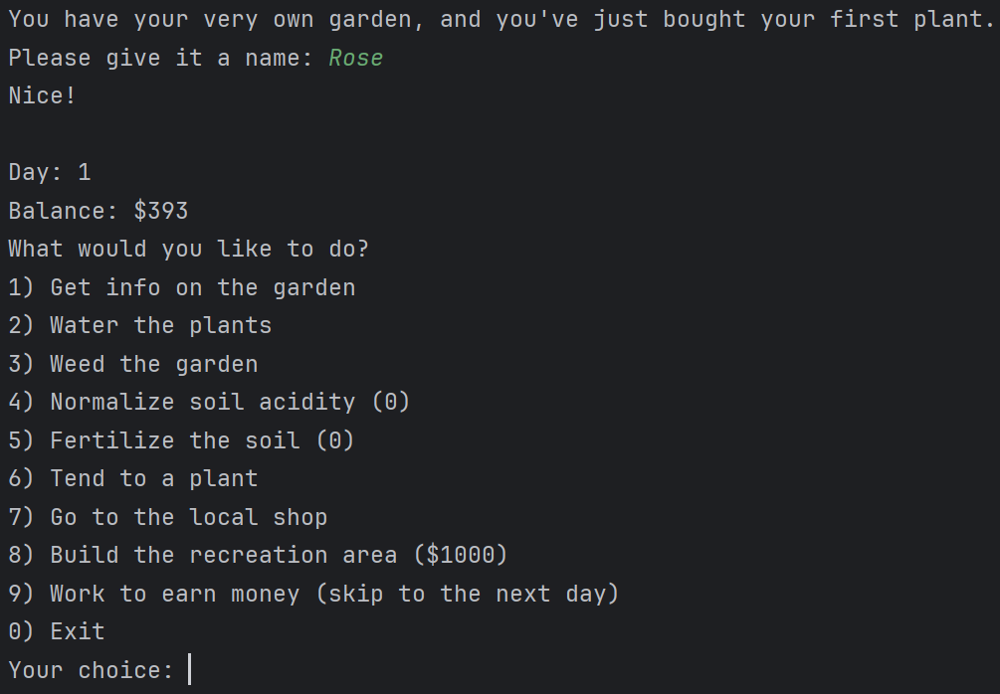

# Лабораторная работа №1
## Вариант 51. Модель садового участка
> Предметная область: управление и облагораживание личного садового участка.

> Важные сущности: участок, растения, почва, инструменты, зона отдыха, система полива.

> Операции: операция посадки и ухода за растениями, операция полива и удобрения, операция декорирования, операция обслуживания инструментов, операция создания зоны отдыха.

## Реализация
Лабораторная работа была выполнена на языке Python с использованием элементов объектно-ориентированной методологии - классов, их объектов и методов.
Работа разделена на папку _src_, содержащую файлы исходного кода (а также файл с исключениями _garden_exceptions.py_ и главный файл приложения _main.py_), и папку _tests_, содержащую тесты на все пользовательские классы. 

Список пользовательских классов:
* _Plant_ - класс растений. Поля: имя растения (строка), здоровье (дробное число, изначально равное от 0 до 1), настроение (дробное число, изначально равное от 0 до 1), размер (случайное дробное число от 0 до 100), живое ли растение (булева переменная).
* _Soil_ - класс почвы. Поля: кислотность (случайное дробное число от 0 до 1), качество (дробное число, изначально равное от 0 до 1).
* _Garden_ - класс садового участка. Поля: список растений (тип _list\[Plant\]_), почва (тип _Soil_).
* _Tool_ - класс инструментов. Поле: прочность (дробное число, изначально равное от 0 до 1).
* _Hoe_ - класс мотыг (подкласс _Tool_).
* _Gardener_ - класс садовода (т.е. пользователя). Поля: деньги (целое число, изначально равное от 50 до 1050), мотыга (тип _Hoe_), количество средств для улучшения кислотного баланса почвы (целое число, изначально равное 0) и количество удобрений (целое число, изначально равное 0).
* _RecreationArea_ - зона отдыха. Поле: состояние (дробное число, изначально равное 0).

## Главный файл приложения

Приложение в _main.py_ реализовано с интерфейсом командной строки в виде меню с бесконечным циклом и вводом цифры, символизирующей выбранный пункт.

Пользователь начинает свой путь с одним растением, со случайным количеством денег и мотыгой в случайном состоянии.
Пункты меню:
1. Получить информацию об участке (вывести список всех растений в участке, имя, размер в сантиметрах, состояние здоровья и настроение каждого, а также кислотный баланс почвы и её качество).
2. Полить все растения (небольшое улучшение здоровья и настроения). Доступно не более 3 раз в день.
3. Избавить участок от сорняков (немного улучшить качество почвы, немного тратится прочность мотыги). Доступно, если мотыга в достаточно хорошем состоянии.
4. Улучшить кислотный баланс почвы. Доступно только при наличии средств для улучшения кислотного баланса почвы у пользователя.
5. Удобрить почву (улучшить качество почвы). Доступно только при наличии удобрений у пользователя.
6. Уход за выбранным пользователем растением (улучшение настроения и небольшое улучшение здоровья). Доступно раз за внутриигровой день.
7. Зайти в магазин, в котором можно:
   * Купить новое растение в сад (150 у.е.)
   * Починить мотыгу (40 у.е.)
   * Купить средство для улучшения кислотного баланса почвы (500 у.е.)
   * Купить удобрение (200 у.е.)
   * Купить украшение для сада (полностью лечит и исправляет настроение растений) (3000 у.е.)
8. Построить зону для отдыха (5 раз, каждый раз по 1000 у.е.). Если она уже построена, вместо этой опции показывается "отдохнуть" (увеличить счётчик дней на 1, немного ухудшается качество почвы, при этом настроение растений улучшается, а здоровье остаётся на прежнем уровне).
9. Работать (увеличить счётчик дней на 1, у пользователя увеличивается количество денег на 200 у.е., но у растений ухудшаются здоровье и настроение, а также немного ухудшается качество почвы. Если здоровье растения ухудшится слишком сильно, оно погибает и удаляется из списка растений в саду).

Наконец, выбор 0 означает выход из программы. Ввод строк, кроме цифр 0-9, считается некорректным, и меню демонстрируется снова.

## Пример работы
Скриншоты ниже демонстрируют примеры использования приложения.

